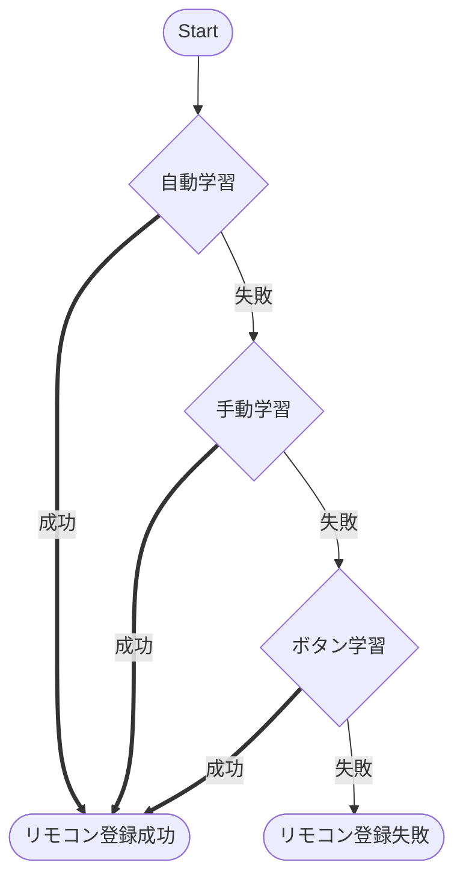

各種スマート家電デバイスを販売しているSwitchBotシリーズから、先日新たにSwitchBotハブ2が発売されました。
今回、このデバイスを買ってみましたので、初期設定や既存デバイスとの連携、自宅の各種リモコンの登録手順をまとめてみます。

@[card](https://www.switchbot.jp/collections/start-your-smart-life/products/switchbot-hub2)

# 概要

SwitchBotハブ2の開封～初期設定、他のSwitchBotデバイスとの連携、リモコンの登録までを順に説明していきます。

# 自宅環境

- SwitchBot温湿度計は既に購入済みだが、インターネット環境には未接続の状態
@[card](https://www.switchbot.jp/pages/switchbot-meter)
- SwitchBotのスマホアプリはインストール済みで、温湿度計のみ登録
@[card](https://apps.apple.com/us/app/switchbot/id1087374760)

元々、以前にSwitchBot温湿度計のみを購入し、スマホアプリとのみ連携していました。
余談ですが、こんな記事も以前書いてます（今は動かないかも・・）。
@[card](https://qiita.com/yankee/items/f1e1fd47a1a3e83501e4)

SwitchBot温湿度計にもBLEが搭載されているため、BLEが届く範囲ではスマホからデータを取得可能でしたが、ハブ機能を活用することで遠隔からのデータ監視が可能になります。

# SwitchBotハブ2の概要

公式ページに掲載されている下の画像のように、大きく4つの機能を持つデバイスです。

@[card](https://www.switchbot.jp/collections/start-your-smart-life/products/switchbot-hub2)

今回、主に使用するのはこの中の**スマートリモコン**機能と**スマートホームハブ**機能になります。

SwitchBotハブ2の商品箱の画像がイメージしやすいと思うので下に載せています。
画像左側の開閉センサーやカーテンなど、既存のSwitchBotデバイスとBLEで通信・連携する部分がハブ機能、
画像右側のエアコンやテレビなどをIR（赤外線）で制御する部分がリモコン機能といった形に大まかには分類できます。
（厳密には、SwitchBotハブ2がWi-Fi経由でインターネット回線につながる部分もハブ機能に含まれるかもしれませんので上の説明はあくまで簡易的なイメージとしてください）

# 開封～起動まで

箱から取り出すと、下の画像のものが含まれています。
最低限使用する物としては、本体・AC USBアダプタ・USB Type-Cケーブルの3つになります。
なお、SwitchBotハブ2には温湿度センサーも付いているんですが、これは本体ではなく、
**ケーブル上にセンサが内蔵**されています。
そのため、必ずSwitchBotハブ2に同梱されたUSB Type-Cケーブルを使用する必要があります。
ちなみに自分が保有しているSwitchBot温湿度計では、背面がマグネット内蔵でしたが、
ハブ2はマグネット内蔵ではないため、壁に固定する際は同梱の両面テープを使用します。

まず、SwitchBotハブ2に電源ケーブルを挿します。
本体背面のスタンド部を開けて、Type-Cケーブルを挿し込みます。
本体背面にも注意書きがありますが、事前にケーブルを軽く曲げておく必要があるようです。

その後、電源を供給すると、SwitchBotハブ2が起動し、温湿度が画面上に表示されます。

# 各種設定

## スマホアプリへのSwitchBotハブ2の登録

まず、今回起動したSwitchBotハブ2をスマホアプリに登録していきます。
今回は既にアプリのインストールは完了しているため、その部分については省略しますが、
初めて使用される方は以下のページなどを参考にして、

- アプリのインストール
- アカウントの作成

を行ってください。

@[card](https://deaz.blog/2023/01/23/%e3%80%90switchbot-%e3%82%a2%e3%83%97%e3%83%aa%e3%80%91%e3%82%a4%e3%83%b3%e3%82%b9%e3%83%88%e3%83%bc%e3%83%ab%e3%81%8b%e3%82%89%e8%a8%ad%e5%ae%9a%e6%96%b9%e6%b3%95%e3%81%be%e3%81%a7%e3%82%8f%e3%81%8b/)

まず、SwitchBotアプリを立ち上げてトップメニューを表示し、右上にある➕ボタンをタップします。

追加メニュー項目として、**○○を追加**の選択肢が何個か出てきますので、今回は`デバイスを追加`を選択します。

画面上部に`Bluetoothデバイスを検出中`の項目が表示され、そこにハブ2のデバイスが検出されるはずです。
自分の場合は温湿度計も保有しているため、そのデバイスも検出されています。
もし、ハブ2のデバイスが検出できない場合は

- ハブ2が正しく起動しているか（電源が入っているか）
- スマホのBluetoothが有効になっているか

などを確認してみてください。

ハブ2を選択すると、下の画面が表示されるため、本体に対して同様の操作を行い、ペアリングします。

ペアリングに成功すると、Wi-Fi設定画面に遷移しますので、選択肢の中からSwitchBotハブ2を接続するSSIDを選択します。
2.4GHz帯のSSIDを選択する必要があります。

最後に、登録名を入力して`保存`ボタンをタップすると登録が完了します。

あらためて、SwitchBotアプリのトップメニューを開くと、SwitchBotハブ2の登録名とハブ2搭載の温湿度が表示されるようになります。

ハブ2の登録名をタップし、詳細画面を表示視した後に右上の⚙ボタンをタップするとハブ2の詳細設定が可能です。

Wi-Fi設定をタップすると、現在接続されているSSIDやIPアドレスが確認できます。
なお、編集からIPアドレスの変更が可能か試みましたが、
**変更できるのはSSIDのみ**で、IPアドレスの変更はできなそうでした。

デバイス情報をタップすると、BLE MACアドレスやWi-Fi MACアドレスの確認も可能です。

## SwitchBot温湿度計との連携

次に、既存のSwitchBotデバイスである温湿度計とハブ2を連携します。
先ほどのアプリトップ画面から、今度は温湿度計の方をタップします。

（はじめてハブ2を連携させる場合、）ハブ2を自動検出して、温湿度計とハブ2を連携させるかのコーション表示がでてくるため`設定へ`をタップします。

設定画面上で、OFFになっている`クラウドサービス`の設定をONに切り替えます。

ONに切り替えると、Hub IDの項目に自動でSwitchBotハブ2が登録されます。

:::message
ハブ機能を持つデバイスが複数ある場合、どのハブと連携するか選択する形になると思われます。
:::

ここまでで、温湿度計とハブ2の連携が完了します。
パッと見は判断がつきづらいですが、スマホのWi-Fi接続を切ってLTE回線に切り替えた場合でも温湿度計のデータが取得できていれば成功です。

## リモコンの登録

**スマートリモコン**は、自宅にあるIRリモコンをSwitchBotハブ2に登録することでスマホアプリ上からリモコン操作を行う機能です。
新規にリモコンを登録する場合、まずスマホアプリのSwitchBotハブ2詳細画面から、
`リモコンを追加`ボタンをタップします。

登録する赤外線リモコンを持つ家電のリストが表示されるので、登録したい家電を選択します。
今回は、エアコンのリモコンを設定しました。

次に、リモコン追加の方法を以下の3つから選択します。

1. リモコン自動学習
2. リモコン手動学習
3. リモコンのボタン学習

この選択肢ですが、他の参考サイトには記載が無かったため、最近のバージョンから多少UIが変更されているようです（今回使用したアプリはVersion7.0）。
で、どれを選べばいいかですが、基本的には、1->2->3の順番で試す形で問題ありません。

フローチャートにすると以下の流れです。

### リモコン自動学習

まずは、一番上の`リモコン自動学習`をタップします。

リモコン登録の手順画面が表示されるので、注意書きを読み、`今すぐ開始`をタップした後に、
ハブ2本体に対してエアコンの電源ボタンを押して赤外線信号を発信します。

赤外線リモコンを受信し、ハブ2側でテンプレートが見つかった場合、以下の画面が表示されるため、テンプレートを試す操作に移ります。
※テンプレートが見つからなかった場合は後述する`リモコン手動学習`を試します

今度は、スマホアプリ上の案内に従いボタンをタップし、エアコンが
このとき、ハブ2本体から赤外線リモコン信号が発信される形になるため、ハブ2本体と家電（今回はエアコン）の位置関係にも注意してください。

家電が正しく動作していれば、`問題なく動いている`をタップします。
リモコンが効かない場合は、`動かない`をタップし、次のテンプレートを試します。

リモコンを保存する画面に切り替わったら、デバイス名を選択して、`保存`をタップして、登録完了になります。

### リモコン手動学習

- 自動学習で赤外線リモコンを受信しても、ハブ2側でテンプレートが見つからなかった場合
- 提案されたテンプレートを全て試してもリモコンが効かなかった場合

ボタン学習or手動学習を提案されるため、手動学習を選択します。

手動学習時は、登録したい家電の型番を一覧から検索します。

型番が見つかった場合、その型番を選択し、リモコンが正しく動作することを確認します。正しく動作したら自動学習の場合同様、名前を登録して完了です。
型番が見つからなかった場合またはリモコンが正しく動作しなかった場合は画面下にあるボタン学習の文字をタップします。

### リモコンボタン学習

ボタン学習はその名の通り、ボタン毎に登録していきます。
基本的に、アプリの指示通りにボタンを登録していけば登録できます。

:::message
各家電毎に登録できるボタンが決まっているため、高機能なモデル（いっぱいボタンがある機種）でも全てのボタンの登録は難しいです。
:::

一通りボタンの登録が終わったら、自動学習同様、リモコン（家電）を登録して完了です。

### どう頑張っても登録できないリモコンもあった

上記の順で登録を試してましたが、ボタン学習まで試しても登録できないリモコンもありました。
（ボタン学習時、ハブ2本体で赤外線信号の受信はできているようですが、その後のテストで家電が動作しない）
手動学習の家電リストにも載っていないマイナーなメーカーの家電だったせいもあるかもしれません。

# その他

## 設置場所の検討

購入後に設置場所に以外と苦心しました。条件として、

1. AC電源がとれる
2. 操作したい家電の赤外線受信範囲
3. Wi-Fiの受信範囲

必要がありますが、複数家電のリモコンの受信範囲を考慮すると、意外と設置場所が限られます。
購入を考えている方は、事前に設置場所を検討しておくといいと思います。

なお、ハブ2の赤外線の送信範囲、受信範囲は取説に記載があり、以下の範囲になります。
個体差もあると思うので、ある程度の参考にしておくレベルがいいと思います。

また、ハブの設置場所については公式のQAにも回答があるので、こちらも参考にしてください。

@[card](https://support.switch-bot.com/hc/ja/articles/360037882334-SwitchBot%E3%83%8F%E3%83%96%E3%83%9F%E3%83%8B-%E3%83%8F%E3%83%96%E3%83%97%E3%83%A9%E3%82%B9%E3%81%AF%E3%81%A9%E3%81%93%E3%81%AB%E8%A8%AD%E7%BD%AE%E3%81%99%E3%82%8C%E3%81%B0%E3%81%84%E3%81%84%E3%81%A7%E3%81%97%E3%82%87%E3%81%86%E3%81%8B-)

## 参考サイト

最後に、参考になった他の方の記事のURLを紹介して終わります。

@[card](https://blog.switchbot.jp/usage/how-to-use-switchbot-hub2/)

@[card](https://www.benrilife.com/switchbot-hub/)

以上
